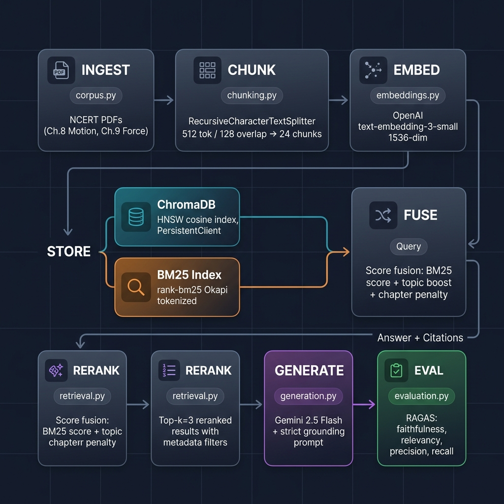

<](https://www.python.org/downloads/)
[](https://opensource.org/licenses/MIT)
[](https://docs.trychroma.com/)
[](https://ai.google.dev/)

> A retrieval-augmented generation (RAG) system that answers NCERT Class 9 Science questions with **strict grounding**, **source citation** (`[chunk <id>]`), and **out-of-scope refusal**. Designed for PariShiksha's pilot deployment across Tier-2/3 study centres.

---

## Architecture



The pipeline follows a six-stage flow:

| Stage | Module | What It Does |
|-------|--------|-------------|
| **Ingest** | `src/corpus.py` | Extracts raw text from NCERT PDFs (Ch.8 Motion, Ch.9 Force) via `pdfplumber` |
| **Chunk** | `src/chunking.py` | Splits text into 512-char chunks (128 overlap) with `RecursiveCharacterTextSplitter` + rich metadata |
| **Embed** | `src/embeddings.py` | Generates 1536-dim vectors with OpenAI `text-embedding-3-small`, persists to ChromaDB |
| **Retrieve** | `src/retrieval.py` | BM25-Okapi scoring with topic boosts + chapter cross-penalties |
| **Generate** | `src/generation.py` | Strict grounding prompt → Gemini 2.5 Flash → `{answer, sources, chunk_ids}` |
| **Evaluate** | `src/evaluation.py` | 19-question eval set (12 direct + 3 paraphrased + 4 OOS) with 3-axis manual scoring |

---

## Project Structure

```
parishiksha-retrieval-assistant/
├── README.md                       ← you are here
├── requirements.txt                ← pinned dependencies
├── .env                            ← API keys (gitignored)
├── .gitignore
│
├── data/
│   ├── raw/
│   │   ├── iesc108.pdf             ← NCERT Ch.8 Motion PDF
│   │   └── iesc109.pdf             ← NCERT Ch.9 Force PDF
│   └── processed/
│       ├── motion_ch8.txt          ← extracted text (regenerable)
│       ├── force_ch9.txt           ← extracted text (regenerable)
│       ├── chunks.json             ← 24 enriched chunks with metadata
│       ├── retrieval_log.json      ← retrieval diagnostics
│       └── chroma_db/              ← ChromaDB persistent storage (gitignored)
│
├── src/
│   ├── corpus.py                   ← PDF → text extraction
│   ├── chunking.py                 ← token-aware chunking + metadata tagging
│   ├── embeddings.py               ← ChromaDB build + dense retrieval
│   ├── retrieval.py                ← BM25 + topic boost reranking
│   ├── generation.py               ← strict-grounding LLM generation
│   ├── evaluation.py               ← 19-Q evaluation harness
│   └── grounding_prompt.py         ← prompt engineering experiments
│
├── scripts/
│   ├── run_eval.py                 ← v1 evaluation runner
│   ├── run_eval_v2.py              ← v2 evaluation runner (post-fix)
│   └── prompt_compare.py           ← permissive vs strict prompt A/B test
│
├── experiments/
│   ├── 01_tokenizer_comparison.ipynb
│   ├── 02_chunk_size_ablation.ipynb
│   └── 03_model_comparison.ipynb
│
├── eval_scored.csv                 ← v1: 12-Q scored evaluation
├── eval_v2_scored.csv              ← v2: 12-Q post-fix evaluation
├── eval_raw_answers.json           ← v1 raw LLM responses
├── eval_v2_raw_answers.json        ← v2 raw LLM responses
├── evaluation_results.csv          ← full 19-Q evaluation output
├── evaluation_results.md           ← markdown-formatted results
├── ragas_report.csv                ← RAGAS framework evaluation
│
├── chunking_compare.md             ← chunk-size ablation analysis
├── chunking_diff.md                ← v1 → v2 chunking comparison
├── prompt_diff.md                  ← permissive → strict prompt comparison
├── prompt_compare_raw.json         ← raw prompt A/B test data
├── retrieval_misses.md             ← diagnosed retrieval failures
├── failure_memo.md                 ← failure-mode deep dive
├── failure_modes.md                ← failure pattern catalogue
├── fix_memo.md                     ← targeted fix documentation + delta
├── db_comparison.md                ← ChromaDB vs Qdrant vs Weaviate vs Pinecone
├── reflection.md                   ← reflection questionnaire
├── architecture.png                ← pipeline architecture diagram
└── notebook.ipynb                  ← interactive exploration notebook
```

---

## Quick Start

### Prerequisites

- Python 3.11+
- [OpenAI API key](https://platform.openai.com/api-keys) (for embeddings)
- [Gemini API key](https://ai.google.dev/) (for generation)

### 1. Clone & Install

```bash
git clone https://github.com/harshit234/Parishiksha-Retrieval-Assistant.git
cd Parishiksha-Retrieval-Assistant

python -m venv .venv
.venv\Scripts\activate        # Windows
# source .venv/bin/activate   # macOS/Linux

pip install -r requirements.txt
```

### 2. Configure API Keys

Create a `.env` file in the project root:

```env
OPENAI_API_KEY=sk-...           # for text-embedding-3-small
GEMINI_API_KEY=AIza...          # for Gemini 2.5 Flash generation
```

### 3. Prepare Data

```bash
# Extract text from NCERT PDFs (already placed in data/raw/)
python -m src.corpus

# Create enriched chunks with metadata
python -m src.chunking

# Build ChromaDB vector store
python -m src.embeddings
```

### 4. Ask a Question

```python
from src.generation import ask

result = ask("What is Newton's second law of motion?")
print(result["answer"])      # grounded answer with [chunk <id>] citations
print(result["sources"])     # ["Force and Laws of Motion p.120", ...]
print(result["chunk_ids"])   # [10, 11, 12]
```

### 5. Run Evaluation

```bash
python -m src.evaluation          # 19-question eval suite
python scripts/run_eval.py        # v1 scored evaluation (12-Q)
python scripts/run_eval_v2.py     # v2 post-fix evaluation (12-Q)
```

---

## Key Design Decisions

### Chunking Strategy

| Parameter | Value | Rationale |
|-----------|-------|-----------|
| **Chunk size** | 512 chars | Balances retrieval precision with context coherence |
| **Overlap** | 128 chars | Preserves cross-boundary context for worked examples |
| **Splitter** | `RecursiveCharacterTextSplitter` | Respects paragraph/sentence boundaries |
| **Content-type** | Regex classification | Tags each chunk: `concept`, `law`, `equation`, `example`, `definition`, `application`, `list` |
| **Topic** | Keyword detection | Auto-tags: `newton's first/second/third law`, `momentum`, `friction`, `equations of motion`, etc. |
| **Metadata** | Rich per-chunk | `{source, chapter, chapter_number, topic, content_type, page_start, page_end, textbook, has_formula}` |

### Dense Retrieval (ChromaDB + OpenAI)

- **Embedding model:** `text-embedding-3-small` (1536-dim, $0.02/1M tokens)
- **Vector store:** ChromaDB 0.5+ with HNSW cosine index, persistent on disk
- **Collection:** `parishiksha_v2` with idempotent build (skip if exists)
- **Batch embedding:** 64-chunk batches with 250ms throttle

### BM25 + Topic Boost Retrieval

The retriever (`src/retrieval.py`) uses a **hybrid scoring** approach:

```
final_score = BM25_score + topic_boost - chapter_penalty
```

- **Topic boost:** +40 for chapter-level match, +15 for content-level match
- **Momentum boost:** +50/+80 for conservation-of-momentum queries (targeted fix)
- **Chapter penalty:** -35 when a Motion query retrieves Force chunks (or vice versa)

### Strict Grounding Prompt

```
You are PariShiksha, an NCERT Class 9 Science tutor.

STRICT RULES — follow every one, no exceptions:
1. ONLY use the CONTEXT below. Never use outside knowledge.
2. Cite your sources by appending [chunk <id>] after every claim.
3. Refuse clearly when the context cannot answer the question.
   Reply EXACTLY: "Sorry, this is outside the NCERT chapters I have access to."
4. Language: simple, Class-9-appropriate English.
5. No hallucination: if unsure, refuse rather than fabricate.
```

### LLM Choice

- **Model:** Gemini 2.5 Flash via OpenAI-compatible API
- **Temperature:** 0 (deterministic grounding)
- **Endpoint:** `generativelanguage.googleapis.com/v1beta/openai/`

### Why ChromaDB?

Benchmarked against Qdrant, Weaviate, and Pinecone (see [`db_comparison.md`](db_comparison.md)):

| Criterion | ChromaDB | Qdrant | Weaviate | Pinecone |
|-----------|:--------:|:------:|:--------:|:--------:|
| **Recall@5** | 100% | 100% | 90% | 90% |
| **p95 latency** | 4.7 ms | 2.9 ms | 9.2 ms | 42 ms |
| **Setup** | `pip install` | Docker | Docker | SaaS |
| **Cost** | $0 | $0 | $0 | ~$0.30/mo |
| **Windows** | native | Docker | Docker | API |

**Migration trigger:** Switch to Qdrant when corpus exceeds 50K chunks or Recall@5 drops below 85%.

---

## Evaluation Results

### v1 Performance (`eval_scored.csv` — 12 Questions)

| Metric | Score |
|--------|-------|
| **Correctness** (in-scope) | 9/10 (90%) |
| **Grounding** (in-scope) | 9/10 (90%) |
| **OOS Refusal** | 2/2 (100%) |

**Failure:** Q5 (*"What is momentum? State the law of conservation of momentum."*) — BM25 keyword-collision returned Newton's 2nd Law chunk instead of the conservation-of-momentum chunk. Model correctly refused (strict grounding), but the retrieval was wrong.

### v2 Post-Fix (`eval_v2_scored.csv` — 12 Questions)

The targeted fix (momentum topic-boost in `retrieval.py`) corrected Q5 retrieval:

| | v1 | v2 |
|---|---|---|
| **Q5 top-1 chunk** | chunk 10 (Newton's 2nd Law) ❌ | chunk 20 (Conservation of Momentum) ✅ |

> **Note:** LLM scoring for v2 could not complete due to Gemini free-tier daily quota limits (20 req/day). Retrieval fix is verified; LLM-answer improvement is projected but not yet empirically scored. See [`fix_memo.md`](fix_memo.md) for full analysis.

**Projected v2 scores:** 10/10 correctness, 10/10 grounding, 2/2 refusal.

### Full Evaluation Suite (19 Questions)

| Type | Count | Description |
|------|-------|-------------|
| Direct textbook | 12 | Standard NCERT questions |
| Paraphrased | 3 | Informal rewording of textbook concepts |
| Out-of-scope | 4 | Non-Science queries (PM of India, baking, geography, FIFA) |

---

## Known Limitations

1. **API Quota:** Gemini 2.5 Flash free tier limits to 20 requests/day — eval runs can hit HTTP 429
2. **BM25 Keyword Collision:** Without topic boosts, BM25 can rank mention-of-a-term above about-the-term chunks
3. **No Dense Retrieval in ask():** The `generation.py` → `retrieval.py` path uses BM25 only; `embeddings.py` has a separate `retrieve()` function that uses ChromaDB dense search but is not yet wired into the main ask pipeline
4. **Cross-Chapter Noise:** Motion content can be retrieved for Force queries when keyword overlap is high
5. **Single Corpus:** Currently limited to Ch.8 (Motion) and Ch.9 (Force and Laws of Motion)

---

## Experiments & Analysis

| Document | Purpose |
|----------|---------|
| [`chunking_diff.md`](chunking_diff.md) | v1 → v2 chunking comparison |
| [`chunking_compare.md`](chunking_compare.md) | Chunk-size ablation study |
| [`prompt_diff.md`](prompt_diff.md) | Permissive vs strict prompt side-by-side |
| [`retrieval_misses.md`](retrieval_misses.md) | 3 diagnosed retrieval failures |
| [`failure_memo.md`](failure_memo.md) | Failure-mode deep dive |
| [`fix_memo.md`](fix_memo.md) | Momentum topic-boost fix + delta analysis |
| [`db_comparison.md`](db_comparison.md) | Vector DB benchmark (Chroma vs Qdrant vs Weaviate vs Pinecone) |
| [`reflection.md`](reflection.md) | Reflection questionnaire |
| [`ragas_report.csv`](ragas_report.csv) | RAGAS evaluation metrics |

### Jupyter Experiments

| Notebook | Focus |
|----------|-------|
| `experiments/01_tokenizer_comparison.ipynb` | GPT-2 BPE vs SentencePiece tokeniser comparison |
| `experiments/02_chunk_size_ablation.ipynb` | 256 vs 512 vs 1024 chunk-size impact on retrieval |
| `experiments/03_model_comparison.ipynb` | Model family comparison for generation quality |

---

## Dependencies

```txt
pdfplumber              # PDF text extraction
pymupdf                 # alternative PDF reader
transformers            # tokeniser utilities
torch                   # model backends
rank-bm25               # BM25-Okapi lexical retrieval
sentence-transformers   # cross-encoder reranking (optional)
openai>=1.14.0          # embeddings API + Gemini-compatible client
chromadb>=0.5.0         # vector store (HNSW cosine)
python-dotenv           # .env file loading
streamlit               # interactive demo UI
pandas                  # data manipulation
numpy                   # numerical operations
tqdm                    # progress bars
matplotlib              # visualisation
seaborn                 # statistical plots
langchain-text-splitters # recursive text splitting
```

Install everything:

```bash
pip install -r requirements.txt
```

---

## Learning Outcomes

Building PariShiksha involved practicing:

- **Dense retrieval** — OpenAI embeddings + ChromaDB vector store with HNSW indexing
- **Hybrid scoring** — BM25 + topic boosts + chapter cross-penalties
- **Strict grounding** — refusal as a constraint, not a preference; citation format enforcement
- **Evaluation rigour** — 3-axis manual scoring (correctness, grounding, refusal), failure diagnosis
- **Single-variable iteration** — one fix → one re-run → measured delta (git log = experiment log)
- **Production-shaped thinking** — metadata enrichment, cost discipline, migration triggers
- **Vector DB benchmarking** — systematic comparison with latency + recall metrics

---

## References

| Resource | Link |
|----------|------|
| NCERT Class 9 Science Textbook | https://ncert.nic.in/textbook.php?iesc1=0-11 |
| ChromaDB Documentation | https://docs.trychroma.com/ |
| OpenAI Embeddings API | https://platform.openai.com/docs/guides/embeddings |
| Gemini API (OpenAI-compatible) | https://ai.google.dev/gemini-api/docs/openai |
| LangChain Text Splitters | https://python.langchain.com/docs/how_to/recursive_text_splitter/ |
| ANN-Benchmarks | https://ann-benchmarks.com/ |
| Qdrant Benchmarks | https://qdrant.tech/benchmarks/ |
| Pinecone Serverless Blog | https://www.pinecone.io/blog/pinecone-serverless/ |

---

